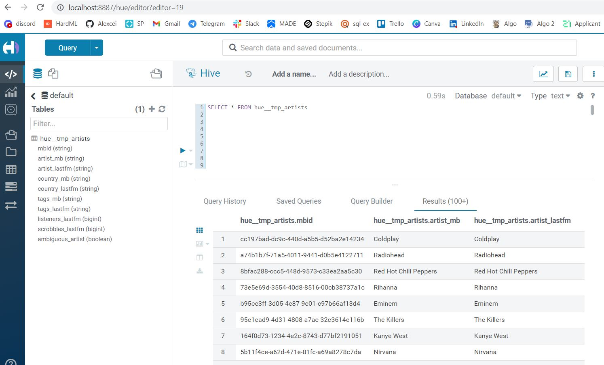

# Блок 1. Развертывание локального Hive



# Блок 2. Работа с Hive

a) Исполнителя с максимальным числом скробблов - 5 баллов

```sql
SELECT
    artist_mb,
    scrobbles_lastfm
FROM hue__tmp_artists
WHERE scrobbles_lastfm IN (
    SELECT MAX(scrobbles_lastfm)
    FROM hue__tmp_artists
    );
```

| artist_mb | scrobbles_lastfm |
| --- | --- |
| The Beatles | 517126254 |
____________________

b) Самый популярный тэг на ластфм - 10 баллов

```sql
SELECT
    tag,
    COUNT(*) AS count_tag
FROM hue__tmp_artists
LATERAL VIEW explode(split(tags_lastfm, ';')) tags_lastfm AS tag
WHERE tag <> ''
GROUP BY tag
ORDER BY count_tag DESC
LIMIT 1;
```

| tag | count_tag |
| --- | --- |
| seen live | 56245 |
____________________

d) Любой другой инсайт на ваше усмотрение - 10 баллов

Найдем топ 10 исполнителей СССР 80-х

```sql
SELECT DISTINCT
    artist_lastfm,
    listeners_lastfm
FROM hue__tmp_artists
LATERAL VIEW explode(split(tags_lastfm, '; ')) tags_lastfm AS tag
WHERE country_lastfm = 'Russia' AND tag = '80s'
ORDER BY listeners_lastfm DESC
LIMIT 10;
```

| artist_lastfm | listeners_lastfm |
| --- | --- |
| seen live | 56245 |
| Кино | 243359 |
| ДДТ | 199078 |
| Ария | 184129 |
| Аквариум | 168435 |
| Nautilus Pompilius | 160833 |
| Гражданская оборона | 152470 |
| Пикник | 143183 |
| Браво | 125992 |
| Сектор Газа | 121777 |
| Машина времени | 114903 |
